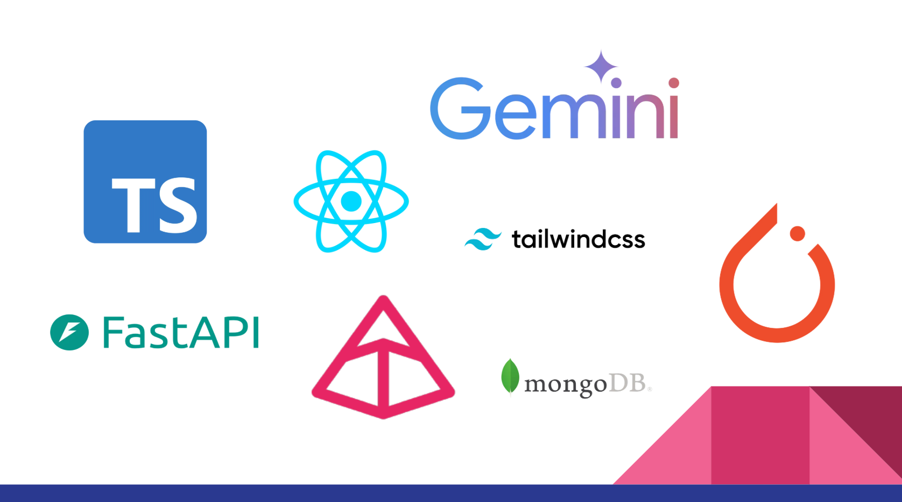

# CVision

CVision is an AI-powered web application designed to streamline the recruitment process. By automatically aggregating and analyzing data from GitHub, social media, and other online sources, CVision generates comprehensive candidate profiles and provides recruiters with actionable insights to make informed hiring decisions.

## 🎥 Demo

<p align="center">
  <a href="https://youtu.be/V4Z31Cdvlxw">
    
  </a>
</p>

##Table of Contents

- [Project Overview](#Project-overview)
- [Features](#Features)
- [Technologies](#Technologies)
- [Installation](#Installation)
- [Usage](#Usage)
- [License](#License)

## Project Overview

Recruiting in today’s competitive market requires sifting through massive amounts of candidate information across multiple platforms. CVision addresses this challenge by:
- Automatically gathering data from various sources (e.g., GitHub, LeetCode, social media, attached resume).
- Analyzing the data using AI and machine learning algorithms.
- Creating detailed, easy-to-read candidate profiles that help recruiters quickly gauge the strengths and potential fit of candidates.

This project was developed during a hackathon, and the modern UI (see branch **03-new-ui**) was built with a focus on intuitive and user-friendly design.

## Features

- **Automatic Candidate Profile Generation:** Seamlessly aggregates data from multiple online sources to build a comprehensive candidate profile.
- **AI-Driven Analysis:** Utilizes machine learning techniques to evaluate candidate skills and potential.
- **Modern and Responsive User Interface:** Developed using the latest UI principles to ensure a smooth user experience.
- **Real-Time Data Integration:** Leverages APIs from platforms like GitHub and LeetCode to fetch up-to-date information.
- **Customizable Reporting:** Offers recruiters the flexibility to tailor candidate insights based on specific parameters.

## Technologies
<p align="center">
  
</p>
- **Frontend:** Developed using modern JavaScript frameworks (e.g., React).
- **Backend:** Built on Python based services.
- **Machine Learning:** Integrates AI/ML APIs (specifically Gemini 1.5 flash) for review generation.
- **API Integrations:** Connects with APIs of GitHub, LeetCode (and more in the future) to gather candidate data.
- **UI/UX:** Intuitive UI on the highest level.

## Installation

### Prerequisites

- [Node.js](https://nodejs.org/) and npm installed on your machine.
- (Optional) [Python](https://www.python.org/) with the required libraries if any Python-based functionality is used.

### Setup Steps

1. **Clone the Repository:**

   ```bash
   git clone https://github.com/JanBanasik/AI_HR.git
   cd AI_HR
   ```

    **Checkout the New UI Branch:**
    ```bash
    git checkout 03-new-ui
    ```

    **Install Dependencies:**
    ```bash
    npm install
    ```

    **Run the Application:**
    ````bash
    npm start
    ````
    **Access the Application:**

    Open your browser and go to http://localhost:3000.

### Usage

**Input Candidate Data:** The recruiter enters one or more URLs pointing to candidate profiles on platforms such as GitHub or LinkedIn.

**Generate Profile:** CVision processes the input to compile a detailed profile based on the aggregated data.

**Review AI Analysis:** The application provides an AI-generated evaluation and recommendations, enabling recruiters to make faster, informed hiring decisions.

### License

This project is licensed under the MIT License – see the LICENSE file for more details.
Contact

For questions, suggestions, or collaboration opportunities, please reach out at [Filip Baciak](f.baciak@student.uw.edu.pl).


